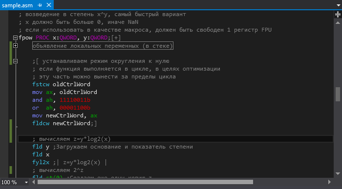

# Assembler Advanced Editor
Assembler extension for Visual Studio 2012+ with highlighting, outlining and dynamic hints.    
Applicable to .asm and .inc files.    
Download compiled extension: [AsmAE.vsix](https://github.com/Refridgerator/ASM-Advanced-Editor/raw/master/bin/Release/AsmAE.vsix)    
Sample file: [sample.asm](https://github.com/Refridgerator/ASM-Advanced-Editor/raw/master/sample.asm)    

## Highlighting
Configure colors from TOOLS->Options...->Fonts and Colors.

## Outlining
Outlining provides through comments.   
* Open region:  
`;[ description`  
* Collapsed by default open region:  
`;[+ description`  
* close region:  
`;]`  
* Collapsed by default PROC or MACRO block:  
`;[+]`

## Dynamic hints
Provide assignment hints to registers through comments.
* Assign hint to first register in the command:   
`;=description`  
or  
`; any comment ;=description`  
* explicit assign  
`;eax=description`
